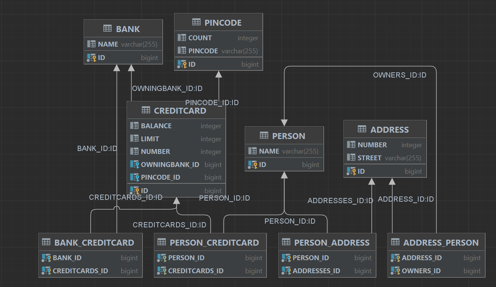

# Technical Problems
The main issue I encountered during expass2 was in the Experiment 2 part, where you were supposed to inspect the database schema. Using IntelliJ as my IDE I set out to follow the tutorial provided at hvl.instructure.com titled Assignment 2: View DB schema in IntelliJ, however I could not get the DB tab to appear. After some research it turns out this is only available in the professional version of IntelliJ and for some reason I was using community edition despite having access to the pro version. Installing the pro version solved this issue and allowed me to inspect the database by following the steps provided in the tutorial. 
Another small issue I encountered was that I got a lot of errors in relation to connecting to the database, deleting the db folder fixed this. 
It also took a bit of time to get back into the swing of Java programming, specifically in regards to typing. An example being `getAddresses` in Person which has return type `Collection<Address>`, Collection being an abstract type and remembering that I then needed to use a typing that implements this type (I settled on ArrayList for this).

# Link to code
The public GitHub repo with the code can be found [here](https://github.com/spectraldesign/dat250-jpa-example). 

# Inspecting the database
To inspect the database I used the built in Database tab in IntelliJ, see Technical Problems above for issues I had in regards to this. After sorting out the issues I simply followed the tutorial provided and added the derby database with username = test and password = test, and the path being the path to the database, in my case C:/Users/Skjalg/IdeaProjects/dat250-jpa-example/db/experiment2. I had to hit refresh (or ctrl+f5) to refresh the database for the contents to show up in the hierarchy. Right-clicking the database "experiment2" and selecting Diagrams -> Show visualization allowed me to inspect the contents of the database in schema form. 
Visualization:

